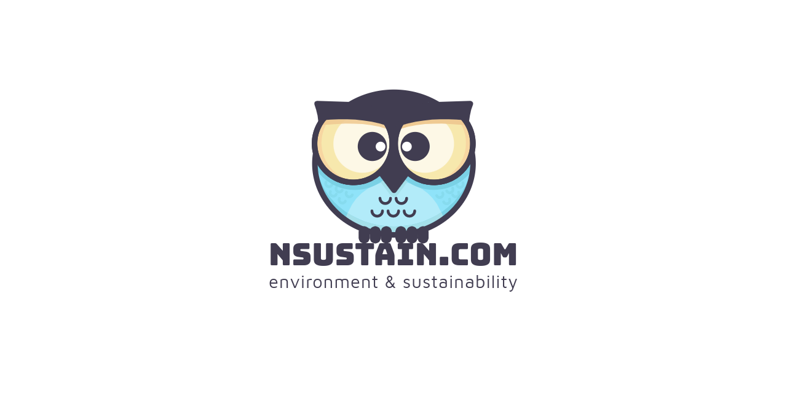

---

  

---

  
  

---

  <b>Official Logo</b>

---

---

<!--
This image is for the social preview
meta tag for our website.

Social preview is optimized for pictures
with the size of 1280x640
-->

---

---

 
 
 
