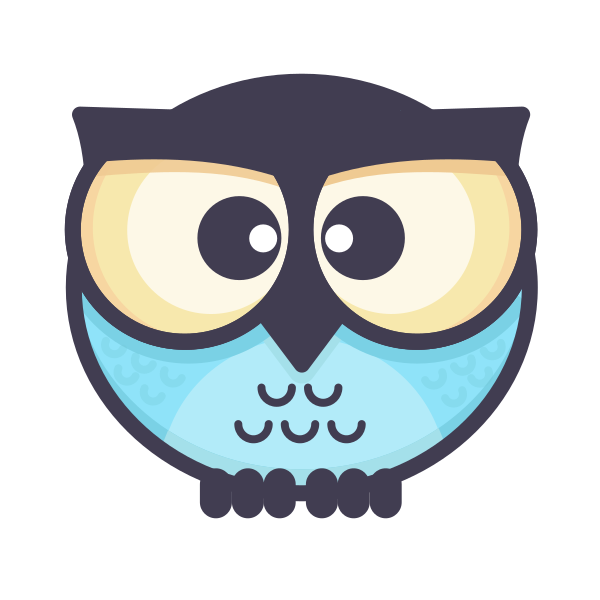
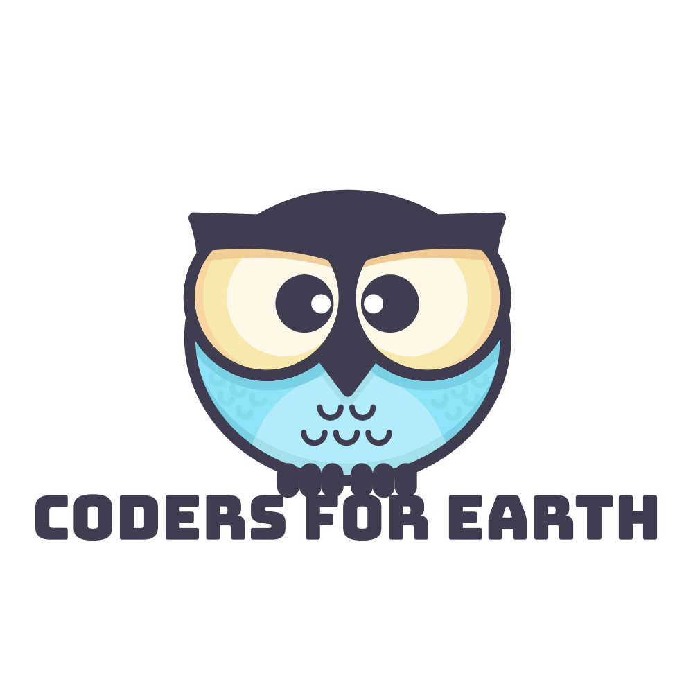
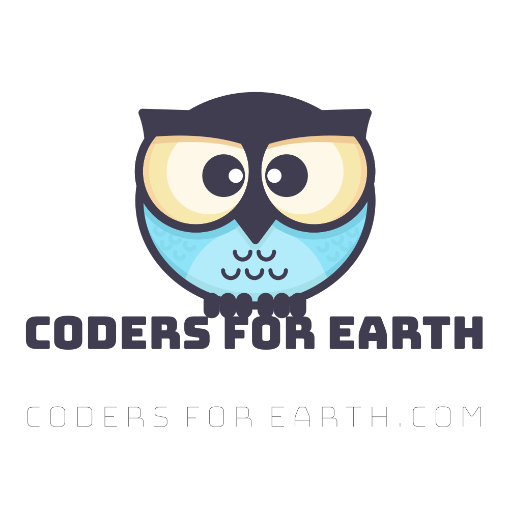
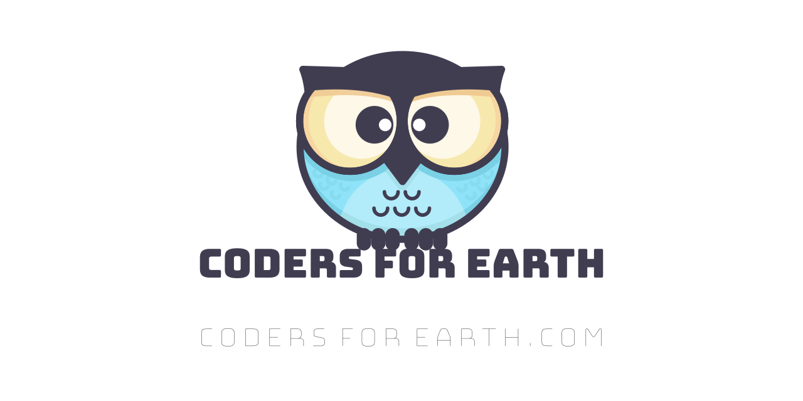

---

  

---

  
  

---

  <b>OFFICIAL LOGO</b>

---

---

---

<!-- 
This image is for the social preview
meta tag for our website.

Social preview is optimized for pictures
with the size of 1280x640
-->

---

  <b>CREDITS</b>

We didn't have to design our logo ourselves,
thanks to `@realvjy`, who published the owl on
[illlustrations.co](https://illlustrations.co/)
and made it open-source. Thank you, `@realvjy`!
Our project name `CODERS FOR EARTH` was added by using
a vector-graphics editor called 
[Boxy SVG](https://boxy-svg.com/),
with Google Fonts `Bungee` 89pt.
 
We initially had a problem with our `.svg` file;
its font would default back to the system font
on `GitHub`. However, we were able to fix this 
issue by choosing the option `Convert texts to paths` 
on `BoxySVG` when exporting the image.

