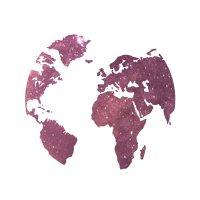
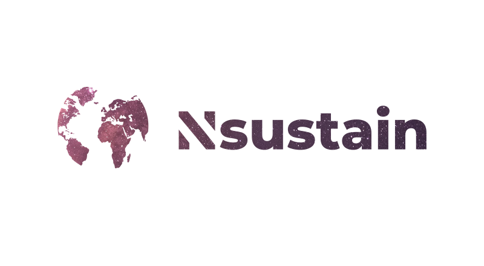

---

  

---

  
  

---

  <b>Official Logo</b>

---

  Our logo represents Earth.
  We use this version as our GitHub organization
  profile picture.

  
---

  The header for our GitHub repositories.

  
---

  The social preview picture for our website.
  This is what you see when you copy and paste
  our website's link on Facebook, Twitter, etc.
  It's designed to be the optimal
  size for a social preview picture,
  which is 1280x640.

---

 
 
 
